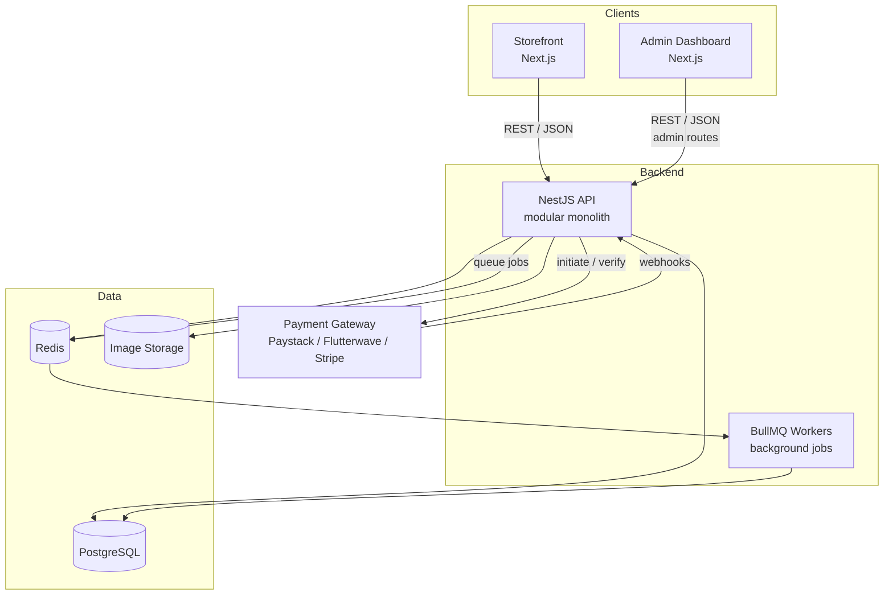
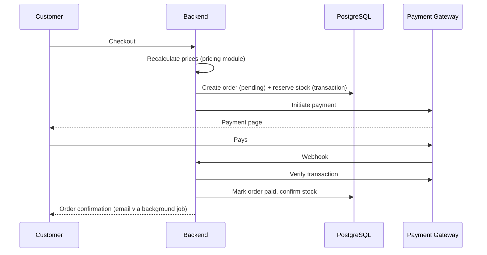

# 🛒 E-Commerce Platform

A full-featured e-commerce platform with a customer storefront, an admin dashboard, and a modular TypeScript backend. It supports product catalogs with filtering, wishlists, carts, secure payments, flash sales, and order management.

> **Status:** Planning / architecture phase. No code has been written yet.

---

## ✨ Features

- this is a monorepo that uses pnpm workspace

### Customer storefront
- Product browsing with categories, variants (size, color, etc.), and images
- Search, filtering, and sorting (price, brand, category, attributes)
- Wishlist with "move to cart" and price-drop / back-in-stock / sale alerts
- Cart for guests and logged-in users (guest carts merge on login)
- Secure checkout and online payments
- Flash sales with countdown timers and limited stock
- Order history and order tracking
- Product reviews and ratings
- Coupons and promo codes
- Account management (profile, saved addresses)

### Admin dashboard
- Product, category, and inventory management
- Order management (status updates, refunds, cancellations)
- Customer management
- Flash-sale creation, scheduling, and live monitoring
- Coupon management
- Review moderation
- Sales overview (revenue, top products, conversion)
- Staff accounts with role-based permissions

---

## 🧱 Tech Stack

| Layer | Technology | Purpose |
|---|---|---|
| Language | **TypeScript** | Type safety across backend and frontends |
| Backend runtime | **Node.js** | Server runtime |
| Backend framework | **NestJS** | Modular, structured API |
| Storefront | **Next.js** (React) | Fast, SEO-friendly customer site |
| Admin dashboard | **Next.js** (React) | Staff interface |
| Database | **PostgreSQL** | Permanent data (users, products, orders, payments) |
| ORM + migrations | **Prisma** | Typed queries and schema migrations |
| Cache / fast storage | **Redis** | Guest carts, caching, sessions, rate limiting, flash-sale stock |
| Background jobs | **BullMQ** (on Redis) | Emails, webhooks, scheduled sales, reservation expiry |
| Authentication | **Passport + JWT** | Login, tokens, role-based access |
| Payments | **Paystack / Flutterwave** (+ Stripe for international) | Checkout and webhooks |
| File storage | **Cloudinary** or S3-compatible storage | Product images |
| Search | **PostgreSQL** full-text → **Meilisearch** (later) | Search and faceted filters |
| API docs | **Swagger** (via NestJS) | Auto-generated API documentation |
| Monorepo | **pnpm workspaces** + **Turborepo** | Manage all apps in one repository |
| Local dev | **Docker** | Run PostgreSQL and Redis locally |

---

## 🏗️ Architecture

The backend is a **modular monolith**: one deployable application, split internally into independent feature modules. This keeps development and deployment simple while leaving the option to extract a module (e.g. payments) into its own service later.



### Architecture principles
- **Modules are isolated.** Each module owns its own data and logic. Modules talk to each other only through service methods, never by reaching into another module's tables.
- **The backend is the source of truth.** Prices, stock, totals, sale status, and payment status are always calculated and verified on the server, never trusted from the frontend.
- **Payments are confirmed by webhook.** An order is marked paid only after the gateway's webhook is received and verified server-side.
- **Money is stored as integers** in the smallest currency unit (kobo / cents) to avoid floating-point errors.
- **Orders snapshot prices.** Each order stores the name and price paid at purchase time, so later product edits don't change past orders.

---

## 📁 Repository Structure

```
ecommerce/
├── apps/
│   ├── api/            # NestJS backend
│   ├── storefront/     # Next.js customer site
│   └── admin/          # Next.js admin dashboard
├── packages/
│   └── shared/         # Shared TypeScript types (Product, Order, etc.)
├── docker-compose.yml  # Local PostgreSQL + Redis
├── turbo.json
├── pnpm-workspace.yaml
└── README.md
```

### Backend structure (`apps/api`)

```
api/
├── src/
│   ├── common/            # Guards, decorators, filters, shared utils
│   ├── config/            # Environment configuration
│   ├── prisma/            # Prisma service
│   ├── modules/
│   │   ├── auth/          # Register, login, JWT, password reset
│   │   ├── users/         # Profiles, addresses
│   │   ├── catalog/       # Products, categories, variants, attributes
│   │   ├── search/        # Filtering, sorting, full-text search
│   │   ├── inventory/     # Stock levels, reservations
│   │   ├── pricing/       # Single source of truth for current prices
│   │   ├── wishlist/      # Add/remove, move to cart, alerts
│   │   ├── cart/          # Guest + user carts, totals, merging
│   │   ├── orders/        # Checkout, order lifecycle
│   │   ├── payments/      # Initiate, verify, webhooks, refunds
│   │   │   └── providers/ # paystack, flutterwave, stripe
│   │   ├── flash-sales/   # Scheduled sales, limited stock, per-user limits
│   │   ├── shipping/      # Rates, zones, tracking
│   │   ├── coupons/       # Discounts, promo codes
│   │   ├── reviews/       # Ratings, moderation
│   │   ├── notifications/ # Email / SMS templates and sending
│   │   └── admin/         # Dashboard stats, staff roles (RBAC)
│   ├── jobs/              # BullMQ job processors
│   └── main.ts
├── prisma/
│   └── schema.prisma      # All database models
└── test/
```

Each module follows the same internal pattern:

| File | Responsibility |
|---|---|
| `*.module.ts` | Registers the module and its dependencies |
| `*.controller.ts` | API routes |
| `*.service.ts` | Business logic |
| `dto/` | Request and response shapes with validation |

---

## 🧩 Module Overview

| Module | Responsibility |
|---|---|
| **auth** | Registration, login, JWT tokens, password reset |
| **users** | Customer profiles and saved addresses |
| **catalog** | Products, categories, variants, and flexible attributes |
| **search** | Filtering, sorting, and full-text product search |
| **inventory** | Stock levels and temporary stock reservations at checkout |
| **pricing** | Calculates the current price of any item, combining base price, flash-sale price, and coupons |
| **wishlist** | Saved items, move-to-cart, and sale / restock notifications |
| **cart** | Guest carts (Redis) and user carts (PostgreSQL), merged on login |
| **orders** | Checkout and the order state machine |
| **payments** | Gateway integration through a common provider interface, webhooks, refunds |
| **flash-sales** | Time-limited sales with limited quantities and per-customer limits |
| **shipping** | Delivery zones, rates, and tracking |
| **coupons** | Promo codes and discount rules |
| **reviews** | Product ratings and review moderation |
| **notifications** | Email and SMS delivery |
| **admin** | Dashboard statistics and staff role management |

---

## 🔄 Key Flows

### Checkout and payment



- Duplicate webhooks are ignored using the gateway's transaction reference (idempotency).
- Unpaid orders expire, and their reserved stock is released by a background job.

### Order lifecycle

```
pending → paid → processing → shipped → delivered
   │        │
   └→ cancelled   └→ refunded
```

### Flash sales

1. An admin creates a sale with start and end times, items, sale prices, limited quantities, and per-customer limits.
2. A scheduled BullMQ job starts the sale and loads each item's sale stock into **Redis**.
3. Customer purchases reduce the Redis count **atomically**, which prevents overselling under heavy traffic.
4. Claimed units are reserved for a short time (e.g. 10 minutes). If unpaid, a delayed job releases them.
5. Successful purchases are recorded permanently in PostgreSQL.
6. A scheduled job ends the sale. Customers who wishlisted sale items can be notified when it goes live.

Flash-sale pages are cached, the buy endpoint is rate-limited against bots, and the backend (not the customer's device clock) decides whether a sale is live.

---

## 🗄️ Data Layer

### PostgreSQL (permanent data)
Users, addresses, products, variants, categories, attributes, inventory, wishlists, user carts, orders, order items, payments, flash sales, coupons, reviews, and staff roles.

- **Transactions** keep checkout safe: stock reservation, order creation, and payment records succeed or fail together.
- **JSONB** columns store flexible product attributes.
- **Indexes** on commonly filtered fields (category, price, brand).

### Redis (fast, temporary data)
- Guest carts
- Cached product and category pages
- Sessions and rate limiting
- Live flash-sale stock counts
- BullMQ job queues

### Background jobs (BullMQ)
- Order confirmation and notification emails
- Payment webhook processing
- Releasing expired stock reservations
- Starting and ending flash sales
- Wishlist alerts (price drops, restocks, sales)
- Syncing products to the search engine (once Meilisearch is added)

---

## 🔐 Security

- Passwords hashed (never stored in plain text)
- JWT authentication with role-based guards for admin routes
- Payment webhooks verified by signature
- Card details never touch our servers; they're handled entirely by the payment gateway
- Server-side validation on every request
- Rate limiting on login, checkout, and flash-sale endpoints
- Secrets stored in environment variables, never committed

---

## 🚀 Getting Started

> Setup instructions will be added once development begins.

**Planned prerequisites:** Node.js (LTS), pnpm, Docker.

**Planned environment variables:**

| Variable | Description |
|---|---|
| `DATABASE_URL` | PostgreSQL connection string |
| `REDIS_URL` | Redis connection string |
| `JWT_SECRET` | Secret for signing tokens |
| `PAYSTACK_SECRET_KEY` | Paystack API key |
| `FLUTTERWAVE_SECRET_KEY` | Flutterwave API key |
| `STRIPE_SECRET_KEY` | Stripe API key (optional) |
| `CLOUDINARY_URL` | Image storage credentials |
| `MAIL_*` | Email provider settings |

---

## 🗺️ Roadmap

- [ ] **Phase 0:** Plan data models (products, variants, cart, wishlist, orders, payments, flash sales)
- [ ] **Phase 1:** Monorepo setup, Docker, Prisma schema
- [ ] **Phase 2:** Auth and users
- [ ] **Phase 3:** Catalog, search, and filters
- [ ] **Phase 4:** Pricing, cart, and wishlist
- [ ] **Phase 5:** Orders and payments (tested in sandbox mode)
- [ ] **Phase 6:** Admin dashboard
- [ ] **Phase 7:** Flash sales
- [ ] **Phase 8:** Shipping, coupons, reviews, notifications
- [ ] **Later:** Meilisearch, analytics, mobile app

---

## ❓ Open Decisions

- [ ] Project / store name
- [ ] Can coupons be combined with flash-sale prices?
- [ ] Does a flash-sale item keep its price if the sale ends before payment?
- [ ] Admin dashboard: Next.js or Vite + React?
- [ ] Payment gateway(s) to launch with
- [ ] Image storage provider
- [ ] Hosting (Railway, DigitalOcean, Render, Vercel for frontends, etc.)

---

## 📄 License

To be decided.
